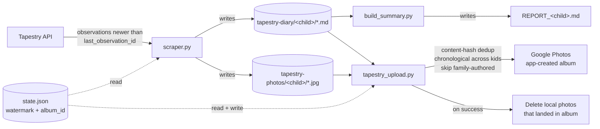

# tapestry-photo-scrapper

[](https://github.com/albinati/tapestry-photo-scrapper/actions/workflows/docker-publish.yml)
[](https://github.com/albinati/tapestry-photo-scrapper/pkgs/container/tapestry-photo-scrapper)
[](https://www.python.org/)
[](LICENSE)

A small, idempotent pipeline that mirrors a [Tapestry Journal](https://tapestryjournal.com) (UK-popular nursery / early-years learning journal) account into a **Google Photos album**, with diary-derived captions and per-child markdown reports.

I built it to keep my kids' nursery records in one place I actually look at — Google Photos — rather than the Tapestry app I forget about. It runs as a one-shot container on a daily timer, and is intentionally boring: small surface, plain Python, one config file.

## What it does



1. **Scrape** new diary observations and photos from Tapestry's parent-side API. The high-water mark `last_observation_id` lives in `state.json`, so re-runs only fetch what's new.
2. **Build** per-child markdown reports (`REPORT_<child>.md`) summarising titles, dates, authors, and teacher comments.
3. **Upload** the photos to a Google Photos album with a caption built from the diary notes + comments and an `Xy Ym old` age string. After a successful run, local photos are deleted (they're in the album now); diary markdown stays for the report.

## Edge cases it handles

These are real cases I hit running this for my own family — the obvious naive implementation gets each one wrong.

- **Cross-kid dedup**. The same school-event photo is tagged on multiple kids' observations — same bytes, same filename. The uploader content-hashes (MD5) before queuing, so each unique image uploads exactly once.
- **Family-authored skip**. Observations posted by parents (whose photos are already in other Google Photos albums via phone backup) are filtered out. Configured by author name in `config.toml`.
- **Same filename, different content**. Two teachers writing separate diaries for the same school week with the same title produce identical filenames but different photos. The uploader keeps one image and **patches the existing media item's description** to include both diaries' text.
- **Library-dedup quirk**. Google Photos' `mediaItems:batchCreate` returns OK and reuses the existing media-item id when bytes match something already in the user's library — but does **not** add it to the album, even with `albumId` set. The uploader follows up with an explicit `albums:batchAddMediaItems`; if that 400s (item not app-created), the photo is left alone — it's already in the user's main library, just not in this album.
- **Chronological order across all kids**, not grouped by child. Tapestry strips EXIF from served JPGs, so Google Photos sorts the album by upload time — getting the upload order right matters.
- **Album not enumerable**. Post–March 2025, `GET /v1/albums` returns 403 for unverified apps. So the pipeline doesn't look the album up by title — it creates the album once, persists `album_id` in `state.json`, and reuses it forever.

## Quick start (Docker)

A multi-arch image is published to `ghcr.io/albinati/tapestry-photo-scrapper:main` on every push to `main`.

```bash
# 1. Lay out config + secrets on the host
mkdir -p /srv/tapestry/{data,secrets}
curl -fsSL https://raw.githubusercontent.com/albinati/tapestry-photo-scrapper/main/.env.example          -o /srv/tapestry/.env
curl -fsSL https://raw.githubusercontent.com/albinati/tapestry-photo-scrapper/main/config.example.toml   -o /srv/tapestry/config.toml
curl -fsSL https://raw.githubusercontent.com/albinati/tapestry-photo-scrapper/main/docker-compose.yml    -o /srv/tapestry/docker-compose.yml
${EDITOR:-vi} /srv/tapestry/.env /srv/tapestry/config.toml

# 2. Drop a Google authorized-user token at /srv/tapestry/secrets/token.json
#    (see "OAuth setup" below to generate one)

# 3. uid 1001 inside the container needs to read these
chown -R 1001:1001 /srv/tapestry/data /srv/tapestry/secrets

# 4. Pull the image
cd /srv/tapestry && docker compose pull
```

Trigger a run on demand:

```bash
docker compose -f /srv/tapestry/docker-compose.yml run --rm tapestry
```

That spins up an ephemeral container, runs the pipeline once, removes itself — **zero idle footprint**, no entries in `docker ps`. The hardening baked into the compose file: read-only root filesystem, all Linux capabilities dropped, `no-new-privileges`, journald logging, 256 MB memory ceiling.

Wire it up to whatever trigger fits: a daily cron, an inbox watcher (Tapestry sends a daily summary mail you can pattern-match on), a webhook. A sample systemd timer is included below.

### Sample systemd timer (daily 4pm London)

```ini
# /etc/systemd/system/tapestry.service
[Unit]
Description=Tapestry Journal -> Google Photos refresh
After=docker.service network-online.target
Requires=docker.service

[Service]
Type=oneshot
WorkingDirectory=/srv/tapestry
ExecStart=/usr/bin/docker compose run --rm tapestry
TimeoutStartSec=30min
SyslogIdentifier=tapestry-timer

[Install]
WantedBy=multi-user.target
```

```ini
# /etc/systemd/system/tapestry.timer
[Unit]
Description=Trigger tapestry refresh once a day

[Timer]
OnCalendar=*-*-* 16:00:00 Europe/London
Persistent=true
RandomizedDelaySec=15min
Unit=tapestry.service

[Install]
WantedBy=timers.target
```

```bash
systemctl daemon-reload && systemctl enable --now tapestry.timer
```

## OAuth setup

You need a Google OAuth client and a token granting the Photos Library scopes.

1. **Create / pick a Google Cloud project** at https://console.cloud.google.com. Enable the **Photos Library API** under *APIs & Services → Library*.

2. **Create an OAuth client** under *APIs & Services → Credentials*. Either application type works:
   - **Desktop app** — simplest. Loopback redirect (`http://localhost`) on any port is allowed automatically.
   - **Web application** — requires you to register specific redirect URIs (e.g. `http://localhost:8080/`). Pick this if you're sharing the client with another service.

   Download the client JSON.

3. **Required scopes**:

   | Scope | Why |
   |---|---|
   | `photoslibrary.appendonly` | Upload media + add to app-created albums. |
   | `photoslibrary.edit.appcreateddata` | Patch descriptions, remove items from album. |
   | `photoslibrary.readonly.appcreateddata` | Read media items in known album ids (used for dedup). |

   > The broader `photoslibrary.readonly` scope still exists but is restricted for unverified apps post–March 2025: requests to `mediaItems:search` and `albums.list` return 403 even on tokens that hold it. The narrower `readonly.appcreateddata` is the supported replacement.

4. **Bootstrap a token** with the bundled `uploader/reauth.py`. It runs a local-loopback OAuth flow, opens a browser, captures the redirect, and writes the token in `google-auth` *authorized-user* format (embeds `client_id`/`client_secret`/`refresh_token`/`scopes`):

   ```bash
   pip install -r requirements.txt
   # Place the OAuth client JSON at ~/.config/google/credentials.json
   # (the script flattens `installed:`/`web:` wrappers automatically)
   python3 uploader/reauth.py
   ```

   Token is written to `~/.config/google/token.json`. Copy or symlink it to `/srv/tapestry/secrets/token.json` for the Docker setup.

5. **Token refresh strategy** — pick one:
   - **App in Testing mode** (the default for unpublished apps): refresh tokens revoke after **~7 days**. Either publish the OAuth consent screen (review can take days, may not be feasible for a personal app) or run `reauth.py` weekly via cron.
   - **Verified or Internal app**: refresh tokens are long-lived; one-time setup.

   The pipeline never writes to the token file at runtime — it only reads + refreshes the access_token in memory. So you can have *any* external process own the file.

## Configuration

`config.toml` (see `config.example.toml` for the full schema):

```toml
[tapestry]
school_slug = "your-school-slug"

[paths]
data_root = "/app/data"     # inside the container

[[children]]
api_name = "First Last"     # exact fullName from Tapestry's API
folder   = "FirstName"      # local folder name (used in caption display too)
display  = "First"          # short name used in Google Photos captions
dob      = "2020-01-15"     # used to compute "Xy Ym old"

[google_photos]
album_title    = "Tapestry"
token_path     = "/secrets/token.json"
family_authors = ["Parent One", "Parent Two"]

[scraper]
cutoff_date = "2024-01-01"  # safety floor, normally you don't need this
```

`.env` (gitignored):

```bash
TAPESTRY_EMAIL=...
TAPESTRY_PASSWORD=...
```

## State and dedup model

`state.json` is the single source of truth between runs:

```json
{
  "last_observation_id": 24528,
  "last_scrape_at": "2026-05-09T16:00:12Z",
  "last_upload_at": "2026-05-09T16:00:18Z",
  "google_photos_album_id": "APbWNS8XYSRR-Yn8X8fglzv9..."
}
```

- **Watermark** (`last_observation_id`): the scraper walks Tapestry's API newest-first and stops the moment it hits an id ≤ the watermark. Re-running with no new observations is a no-op.
- **Album id** (`google_photos_album_id`): persisted on first creation, reused thereafter. The album-by-title lookup the pipeline used to do isn't possible anymore; this is the workaround.

To re-fetch older observations, lower (or delete) the watermark — the scraper will refuse to overwrite files that already exist locally, so it's safe.

To reset the album binding (e.g. you deleted the album), drop `google_photos_album_id` from `state.json` — the next run creates a new one.

## How it talks to Tapestry

Tapestry's parent-facing API isn't documented but is straightforward. After a session-cookie login, the relevant endpoints are:

- `GET /api/4/observations/list?perPage=50&cursor=...` — paginated list, newest first. Returns observation summaries.
- `GET /api/4/observations/get/{id}` — single observation with full notes, comments, and media URLs.

Login is a CSRF-protected `POST /login` with `email`, `password`, and the `_token` value scraped from the school landing page (`/s/<school_slug>`). The school slug is the trailing path component of the URL you see when you log in via the web.

## Project layout

```
tapestry-photo-scrapper/
├── scraper.py                # Tapestry scraper (idempotent, watermarked)
├── build_summary.py          # Markdown reports per child
├── uploader/
│   ├── tapestry_upload.py    # Google Photos uploader
│   └── reauth.py             # One-time OAuth bootstrap
├── run_all.sh                # Orchestrator (scrape → reports → upload)
├── config.py                 # Config loader (TOML + .env)
├── config.example.toml       # Sample config
├── .env.example              # Sample secrets
├── Dockerfile                # 3.12-slim, two-stage, runs as uid 1001
├── docker-compose.yml        # Ephemeral run, hardened defaults
├── requirements.txt
└── runtime files (gitignored):
    ├── .env, config.toml, state.json, scrape_summary.json
    ├── tapestry-photos/<child>/  # downloaded JPGs (deleted after upload)
    ├── tapestry-diary/<child>/   # diary markdown (kept for reports)
    └── REPORT_<child>.md
```

## Troubleshooting

**`mediaItems:search failed: 403 PERMISSION_DENIED`** — the token doesn't have `photoslibrary.readonly.appcreateddata`. Re-run `uploader/reauth.py` after adding the scope. Until you do, the dedup-against-album safety net is off, but the watermark + content-hash dedup keep the pipeline correct in normal operation.

**`Description must not have more than 1000 characters`** — Google Photos caps captions at 1000 chars. The uploader truncates, but if you've extended `generate_description` to add more fields, watch the budget.

**`Token refresh failed (refresh_token may be revoked)`** — your OAuth app is in Testing mode and the refresh token expired after 7 days. Re-run `reauth.py` or set up a weekly auto-refresh.

**Photos appear in Google Photos but not in the album** — usually the library-dedup case: the bytes already existed in your library before this app saw them, so the API silently skipped the album add. The uploader explicitly handles this via `albums:batchAddMediaItems`, but that only works for items the app created. For pre-existing items you can manually add them via the Google Photos UI.

**Photos show with no diary caption** — the uploader couldn't match the photo to a diary entry by slug. Check that the photo filename (`YYYY-MM-DD_<slug>_NN.jpg`) shares a slug with a diary file (`DD-MMM-YYYY_<slug>.md`). Old-format files with broken date prefixes (`30-----202_...`) are also handled but with looser matching.

## Status / scope

This is working code that runs my own family's nursery archive — not a polished product. The README is more thorough than the testing. PRs welcome but I'm not soliciting them; if it doesn't work for your school's Tapestry tenant or your Google project, you'll likely need to read the source.

Issues for bug reports and questions are open.

## License

[MIT](LICENSE).
